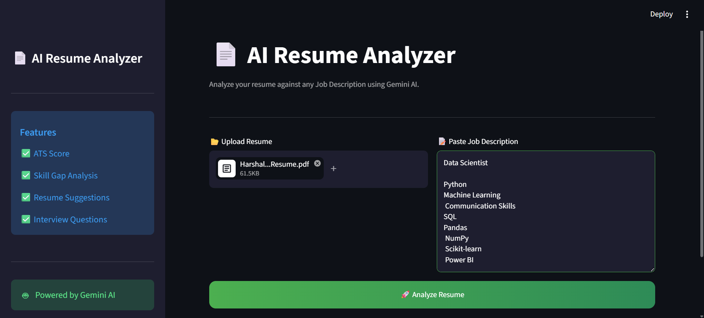
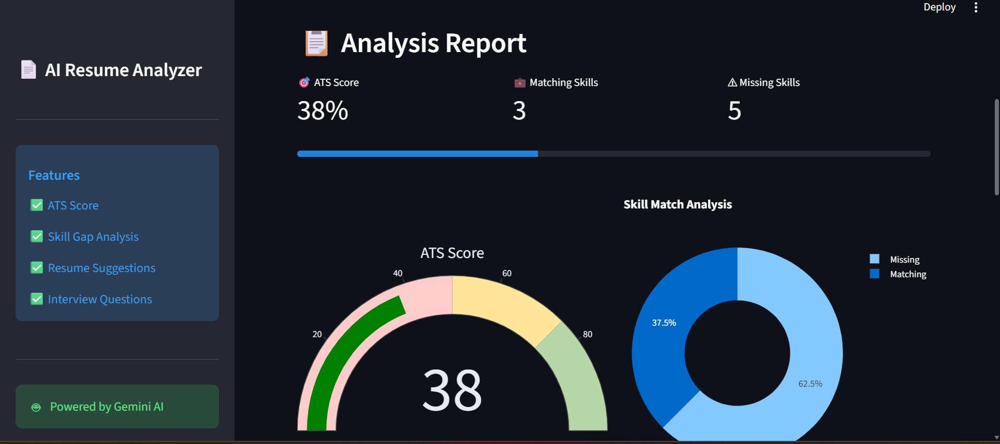
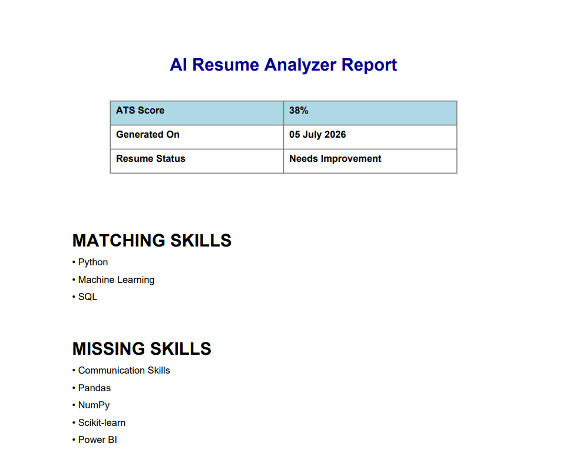

# 📄 AI Resume Analyzer

An AI-powered Resume Analyzer that evaluates resumes against a Job Description using **Google Gemini AI**. It provides an ATS Score, Skill Gap Analysis, Resume Improvement Suggestions, Interview Questions, and a downloadable PDF report through an interactive Streamlit application.

---

## 🚀 Live Demo

🔗 https://your-streamlit-app-url.streamlit.app

---

## 📸 Project Screenshots

### 🏠 Home Page



### 📊 Analysis Report



### 📄 PDF Report



---

## ✨ Features

- 🎯 ATS Score Prediction
- 📄 Resume vs Job Description Analysis
- ✅ Matching Skills Detection
- ❌ Missing Skills Identification
- 💡 Resume Improvement Suggestions
- 💪 Resume Strengths & Weaknesses
- 🎤 AI-Generated Interview Questions
- 📊 Interactive Gauge Chart
- 🥧 Skill Match Pie Chart
- 📥 Download Professional PDF Report
- 🌐 Responsive Streamlit Web Application

---

## 🛠️ Tech Stack

| Technology | Purpose |
|------------|----------|
| Python | Backend Development |
| Streamlit | Web Application |
| Google Gemini AI | Resume Analysis |
| Plotly | Interactive Charts |
| ReportLab | PDF Report Generation |
| PyPDF2 | Resume PDF Text Extraction |

---

## 📂 Project Structure

```
AI_Resume_Analyzer/
│
├── assets/
│   ├── home.png
│   ├── report_analysis.png
│   └── pdf_report.png
│
├── utils/
│   ├── charts.py
│   ├── gemini_helper.py
│   ├── pdf_reader.py
│   ├── report_generator.py
│   └── ui.py
│
├── .streamlit/
│   └── config.toml
│
├── app.py
├── style.css
├── requirements.txt
├── .gitignore
└── README.md
```

---

## ⚙️ Installation

### 1️⃣ Clone Repository

```bash
git clone https://github.com/Harshali2628/AI-Resume-Analyzer.git
```

### 2️⃣ Open Project

```bash
cd AI-Resume-Analyzer
```

### 3️⃣ Create Virtual Environment

```bash
python -m venv venv
```

### 4️⃣ Activate Environment

**Windows**

```bash
venv\Scripts\activate
```

**Mac/Linux**

```bash
source venv/bin/activate
```

### 5️⃣ Install Dependencies

```bash
pip install -r requirements.txt
```

### 6️⃣ Create Environment Variable

Create a `.env` file in the project root.

```
GEMINI_API_KEY=YOUR_API_KEY
```

### 7️⃣ Run the Application

```bash
streamlit run app.py
```

---

## 📈 Workflow

```
Upload Resume (PDF)
        │
        ▼
Extract Resume Text
        │
        ▼
Paste Job Description
        │
        ▼
Google Gemini AI Analysis
        │
        ▼
Generate ATS Score
        │
        ▼
Identify Matching Skills
        │
        ▼
Identify Missing Skills
        │
        ▼
Resume Suggestions
        │
        ▼
Interview Questions
        │
        ▼
Generate Interactive Charts
        │
        ▼
Download PDF Report
```

---

## 📊 Output

The application generates:

- ATS Score
- Matching Skills
- Missing Skills
- Resume Strengths
- Resume Weaknesses
- Resume Improvement Suggestions
- Interview Questions
- Gauge Chart
- Skill Match Pie Chart
- Downloadable PDF Report

---

## 🎯 Future Improvements

- Multi-page Resume Support
- Resume Ranking System
- Multiple Resume Comparison
- Company-Specific ATS Scoring
- Resume Keyword Highlighting
- Resume Template Suggestions
- Cover Letter Generator
- AI Career Guidance

---

## 👩‍💻 Developer

**Harshali Panchal**

📧 Email: hpkpanchal2809@example.com

🔗 LinkedIn: www.linkedin.com/in/harshali-panchal-771b6324a

🐙 GitHub: https://github.com/Harshali2628

---

## ⭐ If you found this project useful, don't forget to give it a Star!
